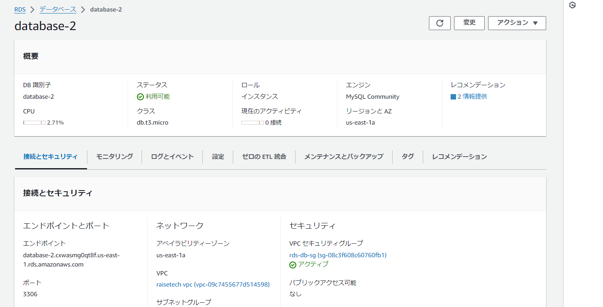

# 第4回課題提出

## vpc構築

## vpc構築-リソースマップ

## EC2インスタンス

 
 
 
## セキュリティーグループ-ec2

## セキュリティーグループ-rds

## RDS構築

　
　

## EC2とRDSの接続

　

## 感じた事

- サブネットやセキュリティグループに関する知識が難しく感じ多く時間を取られた。  その中でもサブネットはまだ理解できていない為、少しずつでも勉強を行う。  またEC2やRDSの構築の際に一つ一つの機能がわからないものが多くある。  今後、お客様相手に自分で考え構築し、説明して納得させることを意識した勉強を  行う必要があると感じた。